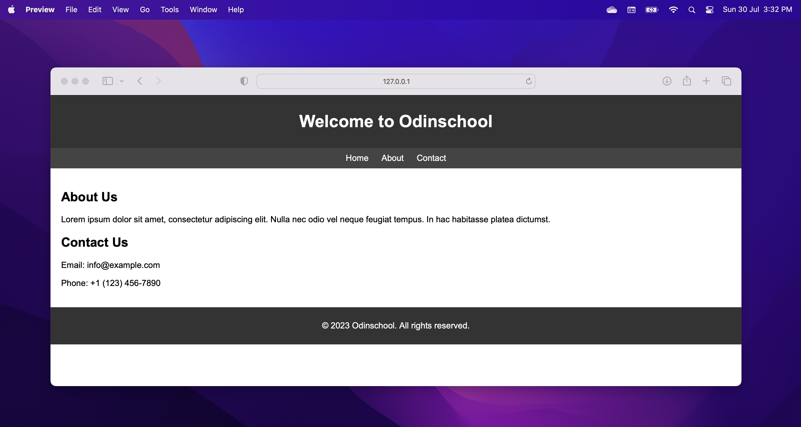
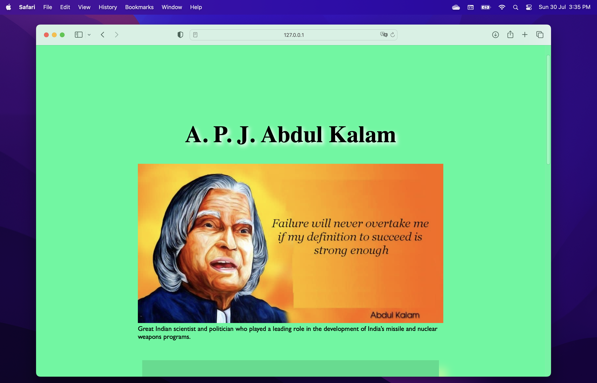
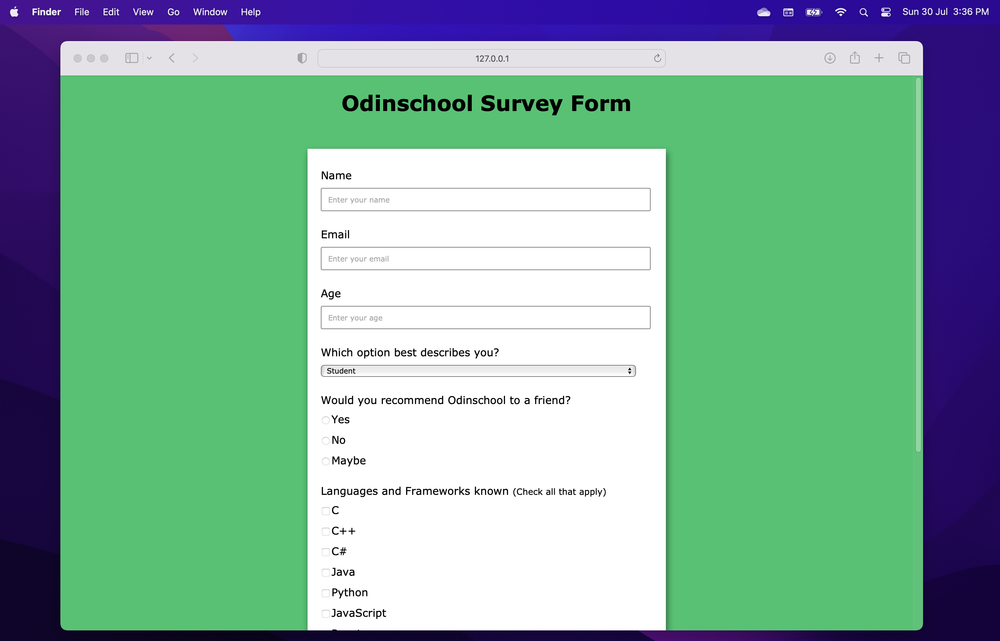
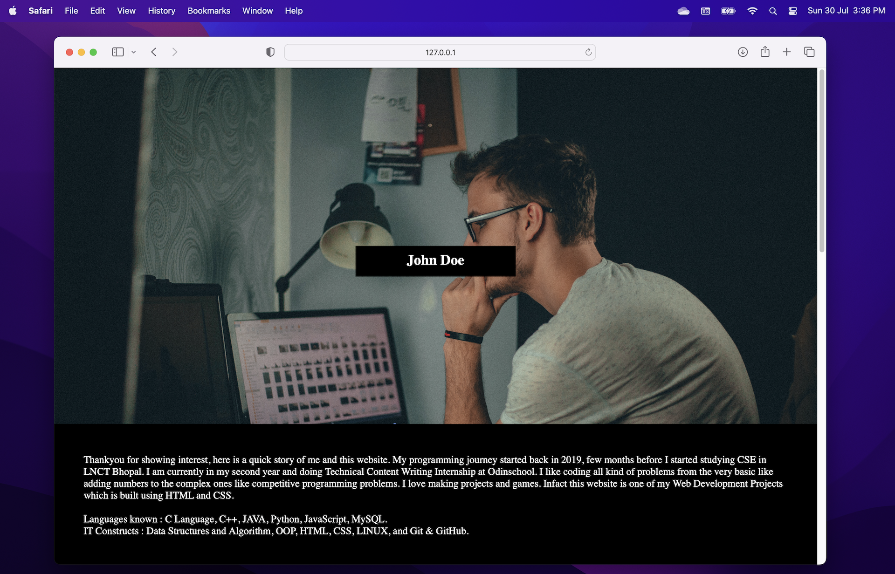
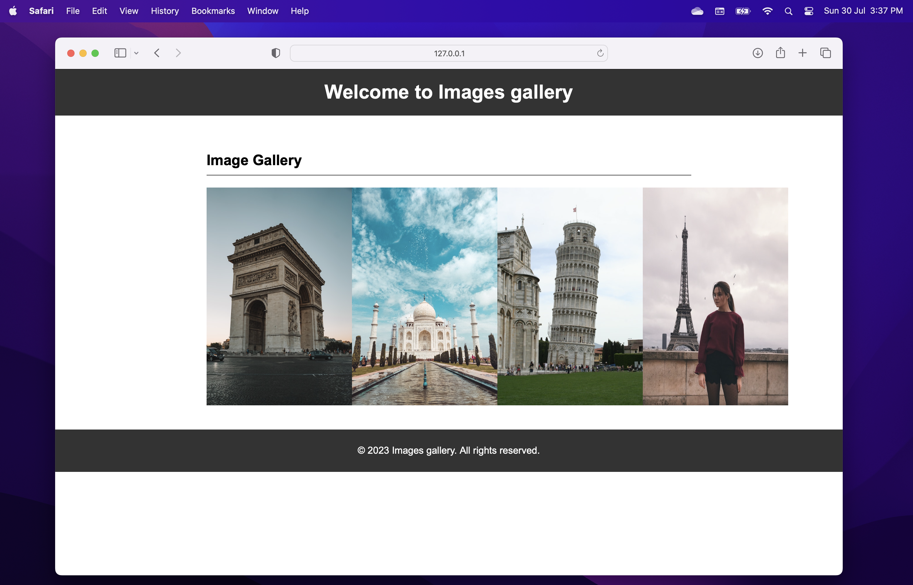
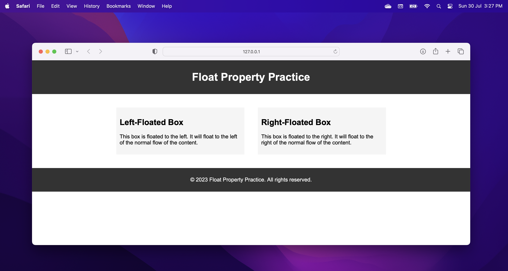

# Odinschool

Odinschool is a leading provider of exceptional web development trainings, delivering top-notch services to aspiring developers. With their expert instructors and hands-on approach, they empower students to acquire essential web development skills and stay at the forefront of this rapidly evolving field. Whether you're a beginner or looking to advance your knowledge, Odinschool ensures a rewarding learning experience, equipping individuals with the tools they need to excel in the world of web development.

This Git repository is a comprehensive hub for web development training resources. It offers a vast array of materials, including training documents, source code samples, valuable tips, and helpful tricks. Additionally, the repository provides engaging practice tasks to enhance learners' skills. Moreover, students can access source codes from live sessions, gaining real-world insights into project development. With this invaluable resource, developers can continuously improve their expertise and excel in the ever-evolving world of web development.

## Practice projects

### HTML and CSS

&ensp;

#### Simple HTML Web page with CSS

[Demo](https://simple-html-css-page.surge.sh/) | [Source code](./practice_projects/html_css/000_simple_html_page/)

&ensp;

#### Tribute To Sir Dr. APJ Abdul Kalam

[Demo](https://tribute-page-to-kalam.surge.sh/) | [Source code](./practice_projects/html_css/001_tribute-page-to-kalam/)

&ensp;

#### Simple Student Survey Form

[Demo](https://student-survey-form.surge.sh/) | [Source code](./practice_projects/html_css/002_student_survey_form/)

&ensp;

#### Simple Parallax effect website

[Demo](https://parallax-website.surge.sh) | [Source code](./practice_projects/html_css/003_parallax_website/)

&ensp;

#### Simple Images Gallery

[Demo](https://odin-images-gallery.surge.sh) | [Source code](./practice_projects/html_css/004_images_gallery/)

&ensp;

#### CSS Float effect practice

[Demo](https://playing_with_css_float.surge.sh) | [Source code](./practice_projects/html_css/005_playing_with_css_float/)

