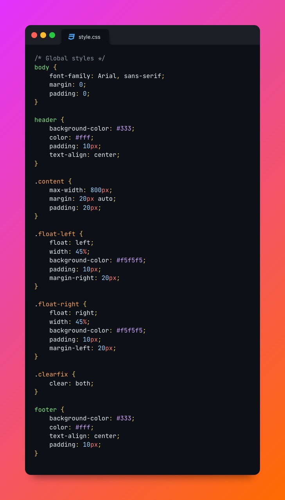
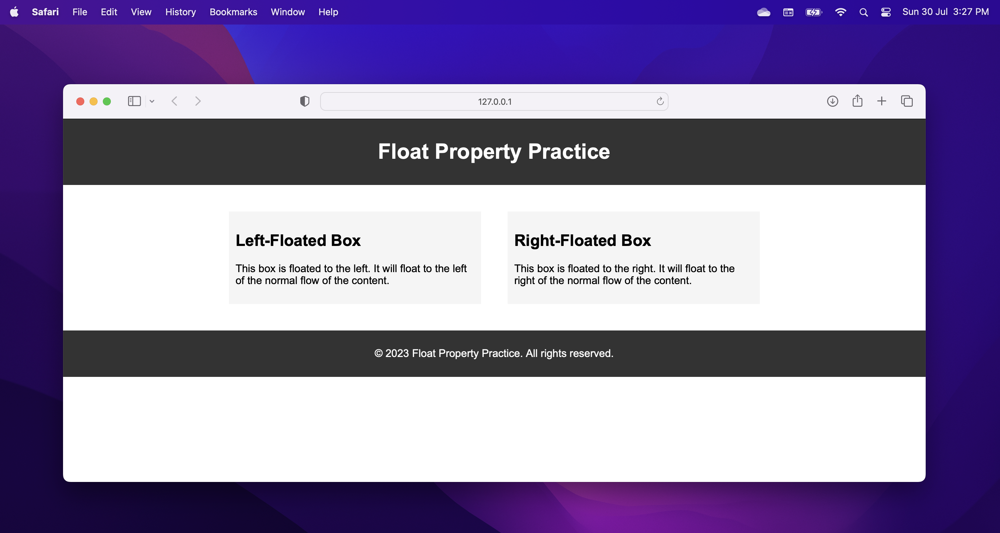

# Simple web page to master css float property

Creating a simple web page to master the CSS float property is a great way to understand its behavior and how it affects the layout of elements. Below is an example of a simple web page that demonstrates the use of the float property. Save the following code in an HTML file (e.g., float_practice.html) and create a separate CSS file (e.g., style.css) to style the page.

float_practice.html:

style.css:

In this example, we have two boxes inside the content section. One box is floated to the left using float: left, and the other box is floated to the right using float: right. The clearfix class is used to clear the float so that the footer appears below the floated boxes.

The content of the floated boxes is wrapped in 
 elements with the classes float-left and float-right. These classes define the float behavior and styling for the floated boxes. The clearfix class is used to ensure that the footer doesn't overlap with the floated boxes.

When you open float_practice.html in your web browser, you should see two boxes side by side, with one floated to the left and the other floated to the right. The footer should appear below the floated boxes due to the use of the clearfix class.

Experiment with the float property and its behavior by modifying the styles and content of this simple web page. This will help you master the float property and understand how it affects the layout of elements.

## Preview

[Source Code](../)

