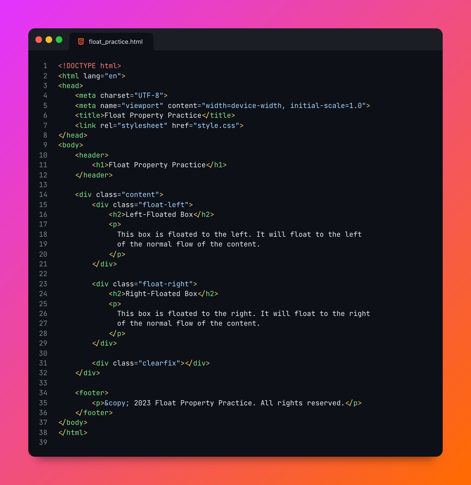

# Simple web page to master css float property

Creating a simple web page to master the CSS float property is a great way to understand its behavior and how it affects the layout of elements. Below is an example of a simple web page that demonstrates the use of the float property. Save the following code in an HTML file (e.g., float_practice.html) and create a separate CSS file (e.g., style.css) to style the page.

float_practice.html:

## Preview

[Source Code](https://linktodocumentation)

